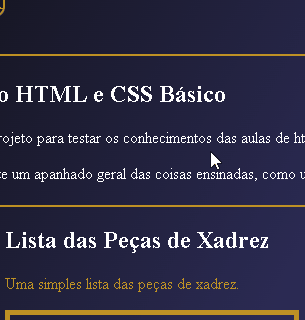
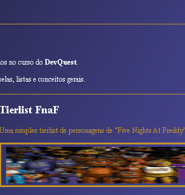

# Testando HTML e CSS 📃
Um de muitos testes que pretendo fazer para testar as diferentes tags HTML apresentadas nas aulas do curso Dev Quest.

## ♟ Lista das peças de Xadrez ♟

Uma página bem simplista pra testar a tag 'ol' (ordered list). Teste do uso de alguns atalhos do VS Code como:
- ol.li*6
- tag strong
- texto alt da imagem

Ainda sem imagem das peças. Mudanças a caminho.

## Tierlist FnaF 🐻

Tierlist usando uma tabela simples e mais uso de CSS do que a página de xadrez. Fazer o header ficar na lateral é algo interessante de tentar:
- cores para a tabela
- header lateral
- texto alt da imagem

Ainda sem imagem dos personagens. Mudanças a caminho.

## 🤓 Aprendizados e observações 🧐
Criar esse projeto, sem nenhuma base ou modelo, foi um desafio interessante. Me fez perceber o quanto tenho que melhorar, principalmente no uso de classes e organização:
- dificuldade em colocar os elementos do código nas posições desejadas;
- organização do código, principalmente no CSS, ficou meio bagunçada e repetitiva;
- uso da borda dos elementos muito simples;
- a parte do xadrez ficou muito simples;

Mas apesar de tudo, o projeto foi um belo teste e estou mais motivado para continuar na programação:
- consegui utilizar de atalhos do teclado para otimizar a produção
- os resumos que escrevi realmente ajudaram
- o uso do Git, para subir o projeto, foi feito sem nenhum problema
- primeira vez codando algo do zero e alguma coisa saiu!

Até o próximo código 😎 !

## Tecnologias utilizadas 💾
- HTML
- CSS